# 🚀 Rapport Technique Kubernetes : Déploiement d'une Application Web Scalable

## 📝 Page de Garde

**Projet :** Déploiement d'une Application Web Scalable avec Kubernetes  
**Élaboré par :** Mazen Masmoudi & Syrine Bensaid  
**Niveau :** Génie Informatique 2.2  
**Année Universitaire :** 2024-2025  

---

## 📑 Sommaire

1. [Introduction](#introduction)
2. [Architecture de la Solution](#architecture-de-la-solution)
3. [Prérequis](#prérequis)
4. [Étapes de Déploiement](#étapes-de-déploiement)
    1. [Démarrage de Minikube](#1-démarrage-de-minikube)
    2. [Build et Push des Images Docker](#2-build-et-push-des-images-docker)
    3. [Application des Manifests Kubernetes](#3-application-des-manifests-kubernetes)
    4. [Vérification des Ressources](#4-vérification-des-ressources)
    5. [Port-Forwarding](#5-port-forwarding)
    6. [Test de Montée en Charge](#6-test-de-montée-en-charge)
5. [Résultats et Tests](#résultats-et-tests)
6. [Considérations Production](#considérations-production)
7. [Conclusion](#conclusion)
8. [Licence](#licence)

---

## 🎯 Introduction

Ce projet démontre la mise en œuvre d'une application web full-stack scalable à l'aide de Docker et Kubernetes, intégrant :

- Conteneurisation via Docker
- Orchestration via Kubernetes
- Stockage persistant avec StatefulSet
- Auto-scaling dynamique via HPA
- Surveillance et montée en charge contrôlées

---

## 🏗️ Architecture de la Solution

```
k8s-scalable-app/
├── frontend/
│   ├── Dockerfile         # Multi-stage React build
│   ├── nginx.conf         # Custom nginx config (port 8080)
│   └── src/               # React source code
├── backend/
│   ├── Dockerfile         # Node.js API server
│   └── src/
│       └── index.js       # Express server with DB connection
├── database/
│   └── init-scripts/
│       └── init.sql       # Database schema
├── k8s/
│   ├── namespace.yaml     # Isolated namespace
│   ├── secret-db.yaml     # Database credentials
│   ├── statefulset-db.yaml# PostgreSQL with persistent storage
│   ├── deployment-*.yaml  # App deployments
│   ├── service-*.yaml     # Service definitions
│   ├── hpa-backend.yaml   # Horizontal Pod Autoscaler
│   └── ingress.yaml       # Ingress configuration
└── docs/                  # Additional documentation
```


- **Frontend :** React (Nginx sur port 8080)
- **Backend :** Node.js (port 3000)
- **Base de Données :** PostgreSQL StatefulSet
- **Orchestration :** Kubernetes + HPA
- **Stockage :** Volume Persistant

---

## ⚙️ Prérequis

- [Docker](https://www.docker.com/)
- [Minikube](https://minikube.sigs.k8s.io/docs/)
- [kubectl](https://kubernetes.io/docs/tasks/tools/)

---

## 🔧 Étapes de Déploiement

### 1. Démarrage de Minikube

```bash
minikube start --driver=docker
```

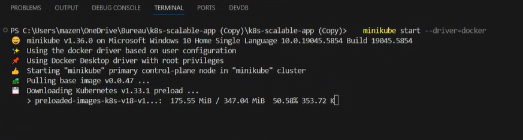
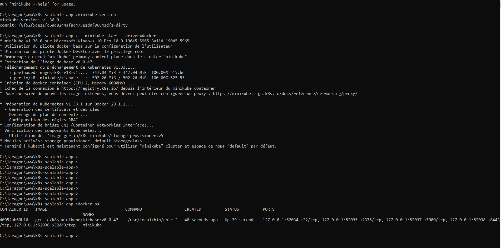


### 2. Build et Push des Images Docker

```bash
docker build -t frontend:latest frontend/
docker build -t backend:latest backend/
```

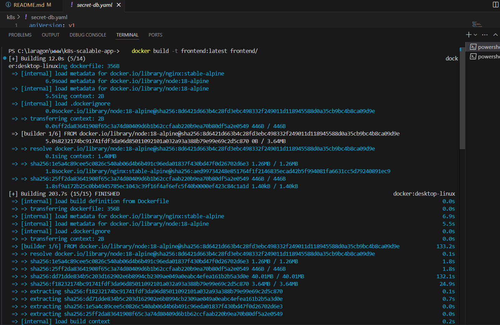
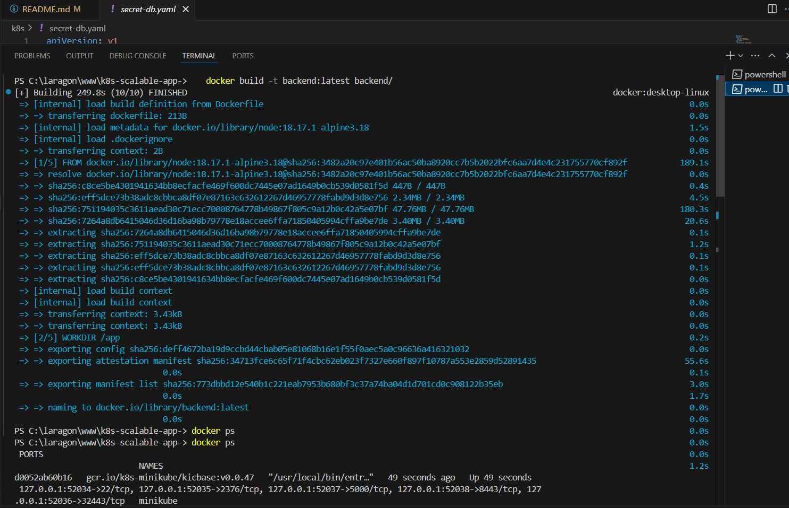


### 3. Application des Manifests Kubernetes

```bash
kubectl apply -f k8s/namespace.yaml
kubectl apply -f k8s/
```

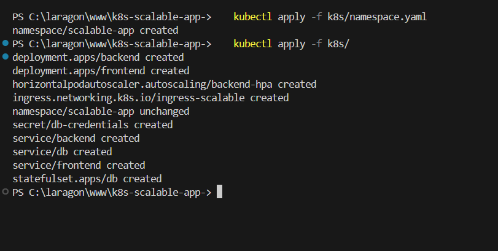

### 4. Vérification des Ressources

```bash
kubectl get pods,svc,hpa -n scalable-app
```

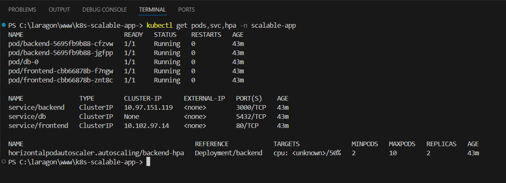

### 5. Port-Forwarding

```bash
kubectl port-forward service/frontend 8080:80 -n scalable-app
```

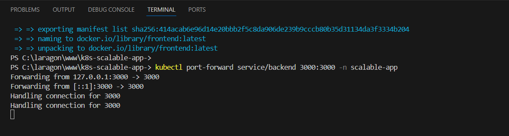
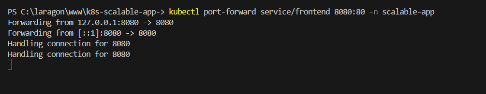

### 6. Test de Montée en Charge

```bash
kubectl run load-test --image=busybox --rm -i -- /bin/sh
while true; do wget -q -O- http://<minikube-ip>/api; done
```

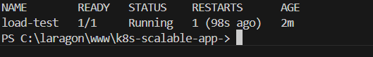

---

## ✅ Résultats et Tests

- Frontend : http://localhost:8080
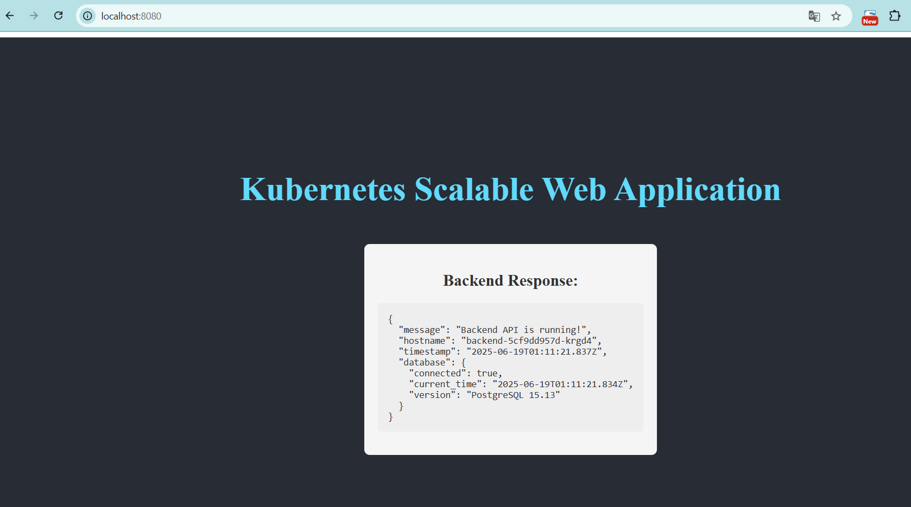
- Backend : http://localhost:3000/api
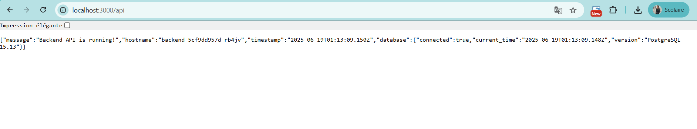

```bash
kubectl get hpa -n scalable-app -w
```

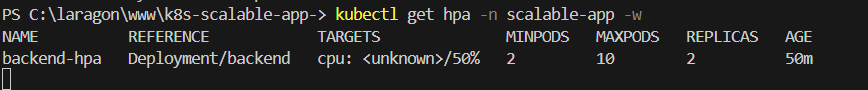

---

## 📌 Considérations Production

- Haute Disponibilité : via HPA
- Stockage Persistant : StatefulSet + PersistentVolume
- Observabilité : Liveness/Readiness probes
- Sécurité : Secrets Kubernetes
- Automation : Scripts de déploiement / tests / nettoyage

---

## 🎯 Conclusion

L'application déployée démontre :

- Scalabilité maîtrisée
- Résilience assurée par Kubernetes
- Automatisation complète du déploiement

---

## 📄 Licence

MIT License
